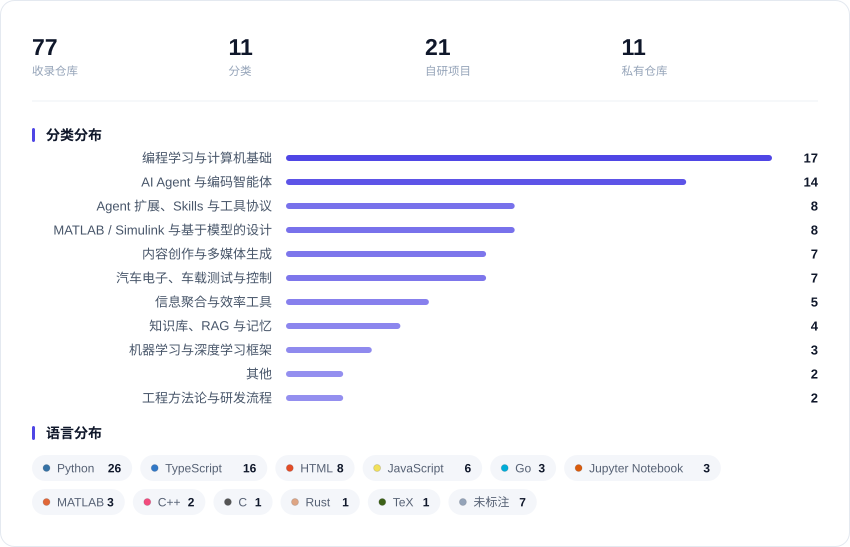

# Starred Toolbox

    

> 我在 GitHub 星标的工具与资源归档。来源只有一个：**我的 Star**。
> 未经星标的内容不会出现在这里。归类与解读由脚本自动生成。

其中 10 个为本人的私有仓库。此处只列出名称、描述与链接等基本信息，其代码与文件内容不对外释放，点击链接需要对应访问权限。

## 概览

<picture>
  <source media="(prefers-color-scheme: dark)" srcset="assets/overview-dark.svg">
  
</picture>

最后同步：2026-09-15 03:52 UTC

### 最近加入

| 仓库 | 分类 | 星标于 |
| :--- | :--- | :--- |
| [Tencent/WeKnora](https://github.com/Tencent/WeKnora) | 知识库、RAG 与记忆 | 2026-09-15 |
| [Tencent/teamai-cli](https://github.com/Tencent/teamai-cli) | Agent 扩展、Skills 与工具协议 | 2026-09-14 |
| [Cocoon-AI/architecture-diagram-generator](https://github.com/Cocoon-AI/architecture-diagram-generator) | 内容创作与多媒体生成 | 2026-09-11 |
| [tt-a1i/archify](https://github.com/tt-a1i/archify) | 内容创作与多媒体生成 | 2026-09-11 |
| [ecubus/EcuBus-Pro](https://github.com/ecubus/EcuBus-Pro) | 汽车电子、车载测试与控制 | 2026-09-10 |

## 目录

| 分类 | 数量 | 占比 |
| :--- | ---: | :--- |
| [AI Agent 与编码智能体](#ai-agent-与编码智能体) | 10 | `███████████` |
| [Agent 扩展、Skills 与工具协议](#agent-扩展skills-与工具协议) | 5 | `█████` |
| [知识库、RAG 与记忆](#知识库rag-与记忆) | 4 | `████` |
| [MATLAB / Simulink 与基于模型的设计](#matlab-simulink-与基于模型的设计) | 7 | `███████` |
| [汽车电子、车载测试与控制](#汽车电子车载测试与控制) | 7 | `███████` |
| [内容创作与多媒体生成](#内容创作与多媒体生成) | 6 | `██████` |
| [信息聚合与效率工具](#信息聚合与效率工具) | 4 | `████` |
| [编程学习与计算机基础](#编程学习与计算机基础) | 15 | `████████████████` |
| [机器学习与深度学习框架](#机器学习与深度学习框架) | 3 | `███` |
| [工程方法论与研发流程](#工程方法论与研发流程) | 2 | `██` |
| [其他](#其他) | 2 | `██` |

另有 [我的自研项目](#我的自研项目) 快捷索引，共 19 个。

## AI Agent 与编码智能体

共 10 个 · [返回目录](#目录)

- **[deepseek-ai/deepseek-harness](https://github.com/deepseek-ai/deepseek-harness)** `TypeScript` `★ 224.3k`
  插件化的 DeepSeek 智能体运行时，一切能力皆以插件形式接入。
  ↳ 想基于 DeepSeek 模型搭建可扩展的编码智能体时。
- **[Significant-Gravitas/AutoGPT](https://github.com/Significant-Gravitas/AutoGPT)** `Python` `★ 187.3k`
  可自主拆解并执行任务的开源 AI 智能体框架。
  ↳ 想研究自主 Agent 的早期实现思路时。
- **[666ghj/MiroFish](https://github.com/666ghj/MiroFish)** `Python` `★ 73.3k`
  通用群体智能引擎，用于多主体行为建模与预测。
  ↳ 需要做群体行为仿真或预测类建模时。
- **[Hmbown/Codewhale](https://github.com/Hmbown/Codewhale)** `Rust` `★ 41k`
  用 Rust 构建的开源终端编码智能体。
  ↳ 想要一个开源、可自行改造的终端编码 Agent 时。
- **[THU-MAIC/OpenMAIC](https://github.com/THU-MAIC/OpenMAIC)** `TypeScript` `★ 36.9k`
  多智能体驱动的交互式课堂，一键生成沉浸式学习体验。
  ↳ 关注多智能体在教育场景如何落地时。
- **[AndyMik90/Aperant](https://github.com/AndyMik90/Aperant)** `TypeScript` `★ 14.6k`
  支持跨多个会话自主推进任务的 AI 编码智能体。
  ↳ 需要 Agent 在长周期任务上持续工作、而不是单轮对话时。
- **[KunAgent/Kun](https://github.com/KunAgent/Kun)** `TypeScript` `★ 6.3k`
  本地优先的 AI 智能体工作台，覆盖编码、写作、设计与研究，统一 GUI 与 TUI 运行时。
  ↳ 想要一个统一入口承载多种 Agent 任务、且数据留在本机时。
- **[sandroandric/AgentHandover](https://github.com/sandroandric/AgentHandover)** `Python` `★ 701`
  观察用户操作习惯，转成可自改进的技能并交接给编码智能体。
  ↳ 想让 Agent 学会你的固定工作方式、不必每次重复交代时。
- **[suzike/agentic-island](https://github.com/suzike/agentic-island)** `TypeScript` `★ 12` `自研`
  常驻 Windows 顶部的 AI 编码智能体监控与审批面板，兼作个人工作台。
  ↳ 想让多个 Agent 的运行状态与待审批请求集中可见时。
- **[suzike-dev/IntentOS](https://github.com/suzike-dev/IntentOS)** `Python` `★ 1` `私有` `自研`
  规范驱动的嵌入式研发平台，含多 Agent 协作与门禁治理。
  ↳ 想用 Spec 驱动方式组织嵌入式软件研发流程时。

## Agent 扩展、Skills 与工具协议

共 5 个 · [返回目录](#目录)

- **[addyosmani/agent-skills](https://github.com/addyosmani/agent-skills)** `JavaScript` `★ 94.4k`
  面向 AI 编码智能体的生产级工程技能集合。
  ↳ 想给 Agent 补上成熟工程实践、减少低级失误时。
- **[Tencent/teamai-cli](https://github.com/Tencent/teamai-cli)** `TypeScript` `★ 4.5k`
  面向团队场景的 AI 命令行工具。
  ↳ 官方描述较简短，具体用法待补充。
- **[omdsh-dev/DSH-better-sidebar](https://github.com/omdsh-dev/DSH-better-sidebar)** `TypeScript` `★ 3.6k`
  可扩展的侧边栏底座，内置文件编辑、终端、Git 与子代理页面。
  ↳ 想给 DeepSeek Harness 增加自定义侧边栏能力时。
- **[suzike/freestyle-dsh-theme](https://github.com/suzike/freestyle-dsh-theme)** `TypeScript` `★ 11` `自研`
  DeepSeek Harness 的主题提案与可视化主题设计器插件。
  ↳ 想自定义 DeepSeek Harness 外观时。
- **[suzike-dev/polarion-mcp-server](https://github.com/suzike-dev/polarion-mcp-server)** `TypeScript` `★ 1` `私有` `自研`
  面向 Polarion SOAP 接口的带权限管控 MCP server。
  ↳ 想让 AI 安全访问 Polarion 需求管理数据时。

## 知识库、RAG 与记忆

共 4 个 · [返回目录](#目录)

- **[Tencent/WeKnora](https://github.com/Tencent/WeKnora)** `Go` `★ 23.3k`
  把原始文档转成可检索的 RAG、推理智能体与自维护 Wiki 的开源知识平台。
  ↳ 需要把私有文档沉淀成可问答知识库、且希望自行部署时。
- **[nashsu/llm_wiki](https://github.com/nashsu/llm_wiki)** `TypeScript` `★ 19.5k`
  把文档自动整理成互链知识库的跨平台桌面应用。
  ↳ 同上，两者描述一致，此为星标数更高的版本。
- **[zenghui-li/yuxi](https://github.com/zenghui-li/yuxi)** `Python` `★ 136`
  集成 LightRAG 知识库与知识图谱的多租户 Agent Harness 平台。
  ↳ 需要为自己的 Agent 搭一套带知识库与图谱的后端时。
- **[suzike/llm_wiki](https://github.com/suzike/llm_wiki)** `TypeScript` `★ 1` `自研`
  把文档自动整理成互链知识库的跨平台桌面应用。
  ↳ 想在本机把零散文档变成可检索的 wiki 时。

## MATLAB / Simulink 与基于模型的设计

共 7 个 · [返回目录](#目录)

- **[matlab/matlab-mcp-server](https://github.com/matlab/matlab-mcp-server)** `Go` `★ 1.5k`
  MathWorks 官方 MCP server，让 AI 应用直接运行 MATLAB。
  ↳ 想让 Claude 等 AI 直接执行 MATLAB 代码时。
- **[matlab/simulink-agentic-toolkit](https://github.com/matlab/simulink-agentic-toolkit)** `HTML` `★ 1.1k`
  让 AI 智能体具备 Simulink 与基于模型设计工作能力的官方工具集。
  ↳ 想让 Agent 参与 Simulink 建模与 MBD 流程时。
- **[matlab/matlab-agentic-toolkit](https://github.com/matlab/matlab-agentic-toolkit)** `MATLAB` `★ 1k`
  把 MATLAB 能力封装给 AI 智能体使用的官方工具集。
  ↳ 需要让 Agent 稳定调用 MATLAB 工程能力时。
- **[matlab/agent-skills-playground](https://github.com/matlab/agent-skills-playground)** `HTML` `★ 178`
  面向 MATLAB/Simulink 的 Agent Skills 原型与演示沙箱。
  ↳ 想为 MATLAB 工作流编写自定义 Agent 技能时的起点。
- **[suzike/DeepSeekMatlabCopilot](https://github.com/suzike/DeepSeekMatlabCopilot)** `MATLAB` `★ 11` `自研`
  面向 MATLAB 工程流程的 DeepSeek 辅助工具。
  ↳ 想在 MATLAB 工作中接入 DeepSeek 时。
- **[suzike-dev/Matlab-Simulink-SuperAgent](https://github.com/suzike-dev/Matlab-Simulink-SuperAgent)** `JavaScript` `★ 1` `私有` `自研`
  内嵌进 MATLAB/Simulink 界面的 AI 智能体，支持多种模型后端。
  ↳ 想在建模环境里直接调用 AI 辅助、不来回切换窗口时。
- **[suzike-dev/model-code-to-srs](https://github.com/suzike-dev/model-code-to-srs)** `Python` `★ 1` `私有` `自研`
  从 Simulink/Stateflow 模型与生成代码反推中文软件需求规格的 Agent Skill。
  ↳ 需要为已完成的模型补齐可评审 SRS 文档时。

## 汽车电子、车载测试与控制

共 7 个 · [返回目录](#目录)

- **[pms67/PID](https://github.com/pms67/PID)** `C` `★ 933`
  C 语言实现的 PID 控制器。
  ↳ 需要在嵌入式项目中集成 PID 控制时。
- **[ecubus/EcuBus-Pro](https://github.com/ecubus/EcuBus-Pro)** `C++` `★ 870`
  覆盖 UDS、CAN-TP、DOIP、LIN 与类 CAPL 脚本的汽车 ECU 开发与 HIL 测试工具。
  ↳ 做 ECU 诊断、总线通信或 HIL 测试、又不想依赖商业工具链时。
- **[auto-py-utils/py-canoe](https://github.com/auto-py-utils/py-canoe)** `Python` `★ 115`
  用于控制 Vector CANoe 的 Python 包。
  ↳ 想用 Python 脚本驱动 CANoe 时。
- **[suzike-dev/Agent2Canape](https://github.com/suzike-dev/Agent2Canape)** `Python` `★ 1` `私有` `自研`
  面向整车工程任务的 Vector CANape 自动化、分析与安全编排平台。
  ↳ 需要把标定与测量流程脚本化时。
- **[suzike-dev/Agent2Canoe](https://github.com/suzike-dev/Agent2Canoe)** `Python` `★ 1` `私有` `自研`
  面向 Vector CANoe 的自然语言与 AI Agent 自动化平台。
  ↳ 想让 AI 驱动 CANoe 测试流程时。
- **[suzike-dev/Intelligent-Calibration-platform](https://github.com/suzike-dev/Intelligent-Calibration-platform)** `Python` `★ 1` `私有` `自研`
  面向智能热管理与空调舒适性的实车标定平台。
  ↳ 需要管理热管理标定数据与试验流程时。
- **[suzike-dev/Vehicle-Thermal-LLM-MultiAgent](https://github.com/suzike-dev/Vehicle-Thermal-LLM-MultiAgent)** `Python` `★ 1` `私有` `自研`
  面向汽车空调热舒适的大模型驱动多智能体系统。
  ↳ 研究大模型在热舒适控制中的应用时。

## 内容创作与多媒体生成

共 6 个 · [返回目录](#目录)

- **[AUTOMATIC1111/stable-diffusion-webui](https://github.com/AUTOMATIC1111/stable-diffusion-webui)** `Python` `★ 164.9k`
  本地部署的 Stable Diffusion 图像生成 Web 界面。
  ↳ 想在本机跑文生图、且需要完整参数控制与插件生态时。
- **[tt-a1i/archify](https://github.com/tt-a1i/archify)** `JavaScript` `★ 62.5k`
  生成架构图、流程图、时序图与数据流图的自包含 HTML Agent Skill。
  ↳ 需要带动效、可导出、可验证的技术图表时。
- **[ATH-MaaS/Pixelle-Video](https://github.com/ATH-MaaS/Pixelle-Video)** `Python` `★ 28.1k`
  AI 全自动短视频生成引擎。
  ↳ 需要批量产出短视频内容时。
- **[easydiffusion/easydiffusion](https://github.com/easydiffusion/easydiffusion)** `JavaScript` `★ 10.5k`
  一键式本地 AI 绘图工具，面向无技术背景用户。
  ↳ 想零配置体验本地图像生成时。
- **[Cocoon-AI/architecture-diagram-generator](https://github.com/Cocoon-AI/architecture-diagram-generator)** `HTML` `★ 7.3k`
  把系统架构描述生成独立 HTML/SVG 架构图的 Claude Skill。
  ↳ 需要快速产出可分享的架构图、又不想手绘时。
- **[suzike/nanju-write-paper](https://github.com/suzike/nanju-write-paper)** `HTML` `★ 5` `自研`
  从选题到成稿的写作流水线 Skill，含多 Agent 调研、五角色审查与多尺寸卡片版式输出。
  ↳ 需要把技术选题批量产出为长文与公众号/PDF 版式时。

## 信息聚合与效率工具

共 4 个 · [返回目录](#目录)

- **[sansan0/TrendRadar](https://github.com/sansan0/TrendRadar)** `Python` `★ 62.3k`
  聚合多平台热点与 RSS 的 AI 舆情与趋势监控工具，支持多通道推送。
  ↳ 想用关键词订阅热点并定时收到简报时。
- **[guaguastandup/zotero-pdf2zh](https://github.com/guaguastandup/zotero-pdf2zh)** `Python` `★ 6.4k`
  Zotero 的 PDF 中文翻译插件。
  ↳ 需要读英文论文并要中文对照时。
- **[suzike/Office-Viewer](https://github.com/suzike/Office-Viewer)** `TypeScript` `★ 2` `自研`
  Windows 桌面文档查看与编辑器，支持 Office、Markdown、压缩包与 Git 历史。
  ↳ 想不装 Office 也能快速查看和编辑文档时。
- **[suzike/RobinRead](https://github.com/suzike/RobinRead)** `JavaScript` `★ 2` `自研`
  本地优先、AI 增强的纸感三栏 RSS 阅读器（Windows / Electron）。
  ↳ 想要不依赖云端的 RSS 阅读体验时。

## 编程学习与计算机基础

共 15 个 · [返回目录](#目录)

- **[ossu/computer-science](https://github.com/ossu/computer-science)** `HTML` `★ 209k`
  免费的计算机科学自学课程路线。
  ↳ 想按完整课程体系自学 CS 时。
- **[jackfrued/Python-100-Days](https://github.com/jackfrued/Python-100-Days)** `Jupyter Notebook` `★ 186.5k`
  从入门到进阶的 Python 系统教程，按天组织。
  ↳ 想按天推进、系统学完 Python 时。
- **[521xueweihan/HelloGitHub](https://github.com/521xueweihan/HelloGitHub)** `Python` `★ 176.6k`
  面向入门者的开源项目推荐月刊。
  ↳ 想发现适合上手的开源项目时。
- **[justjavac/free-programming-books-zh_CN](https://github.com/justjavac/free-programming-books-zh_CN)** `★ 118.9k`
  免费计算机技术中文书籍索引。
  ↳ 需要找中文技术书时。
- **[izackwu/TeachYourselfCS-CN](https://github.com/izackwu/TeachYourselfCS-CN)** `★ 22.2k`
  计算机科学自学路线指南的中文翻译。
  ↳ 想按体系补齐计算机基础、又需要中文材料时。
- **[zergtant/pytorch-handbook](https://github.com/zergtant/pytorch-handbook)** `Jupyter Notebook` `★ 21.7k`
  PyTorch 入门开源书籍，教程均可运行。
  ↳ 想系统学习 PyTorch 时。
- **[Yixiaohan/show-me-the-code](https://github.com/Yixiaohan/show-me-the-code)** `★ 13.7k`
  Python 练习册，每天一个小程序。
  ↳ 想通过小练习巩固 Python 基础时。
- **[jikexueyuanwiki/tensorflow-zh](https://github.com/jikexueyuanwiki/tensorflow-zh)** `TeX` `★ 12.3k`
  TensorFlow 官方文档的中文翻译。
  ↳ 需要查阅中文 TensorFlow 文档时。
- **[lawlite19/MachineLearning_Python](https://github.com/lawlite19/MachineLearning_Python)** `Python` `★ 8.6k`
  机器学习算法的 Python 实现合集。
  ↳ 想对照代码理解经典算法时。
- **[jackzhenguo/python-small-examples](https://github.com/jackzhenguo/python-small-examples)** `Python` `★ 8.1k`
  Python 实用小例子合集。
  ↳ 想快速查某个 Python 写法的实例时。
- **[billryan/algorithm-exercise](https://github.com/billryan/algorithm-exercise)** `Python` `★ 3.5k`
  数据结构与算法题解笔记，含 LeetCode 与 LintCode。
  ↳ 刷题或复习算法时。
- **[datawhalechina/hugging-llm](https://github.com/datawhalechina/hugging-llm)** `Jupyter Notebook` `★ 3.1k`
  Datawhale 出品的大模型入门与实践教程。
  ↳ 想跟着中文教程系统入门大模型时。
- **[datawhalechina/team-learning](https://github.com/datawhalechina/team-learning)** `★ 2.4k`
  Datawhale 组队学习计划的资料汇总。
  ↳ 想跟着组队节奏推进学习时。
- **[yidao620c/core-algorithm](https://github.com/yidao620c/core-algorithm)** `Python` `★ 781`
  常见算法的 Python 实现集合。
  ↳ 复习算法实现细节时。
- **[suzike/EmbedSummary](https://github.com/suzike/EmbedSummary)** `★ 1` `自研`
  嵌入式开发资源汇总。
  ↳ 需要嵌入式方向的资料索引时。

## 机器学习与深度学习框架

共 3 个 · [返回目录](#目录)

- **[tensorflow/models](https://github.com/tensorflow/models)** `Python` `★ 77.7k`
  TensorFlow 官方模型与示例库。
  ↳ 想找官方模型实现作参考时。
- **[PaddlePaddle/Paddle](https://github.com/PaddlePaddle/Paddle)** `C++` `★ 24.1k`
  百度开源的深度学习框架（飞桨）。
  ↳ 需要在国产框架上训练与部署模型时。
- **[suzike-dev/AITrain_Platform](https://github.com/suzike-dev/AITrain_Platform)** `Python` `★ 1` `私有` `自研`
  覆盖 AI 算法开发、训练与部署的研发可视化管理平台。
  ↳ 需要统一管理算法研发全流程时。

## 工程方法论与研发流程

共 2 个 · [返回目录](#目录)

- **[xdash/FDE-the-Guidance-Book-of-Forward-Deployed-Engineer](https://github.com/xdash/FDE-the-Guidance-Book-of-Forward-Deployed-Engineer)** `★ 4.7k`
  前沿部署工程师（FDE）的从零入门指南。
  ↳ 想了解 FDE 岗位的能力模型与工作方法时。
- **[huangjia2019/sdd-in-action](https://github.com/huangjia2019/sdd-in-action)** `Python` `★ 147`
  规范驱动开发的实战手册，覆盖 Claude Code 与 OpenCode 两条路径。
  ↳ 想系统学习 SDD 如何落地到日常开发时。

## 其他

共 2 个 · [返回目录](#目录)

- **[suzike-dev/kill-issue](https://github.com/suzike-dev/kill-issue)** `Python` `★ 1` `私有` `自研`
  仓库暂无描述，用途待补充。
  ↳ 信息有限，待补充。
- **[suzike/suzike](https://github.com/suzike/suzike)** `Python` `★ 1` `自研`
  个人主页 README。
  ↳ 信息有限，待补充。

## 我的自研项目

以下仓库同时出现在上方对应分类中，此处仅作快捷索引。

| 仓库 | 所属分类 |
| :--- | :--- |
| [suzike-dev/Agent2Canape](https://github.com/suzike-dev/Agent2Canape) | 汽车电子、车载测试与控制 |
| [suzike-dev/Agent2Canoe](https://github.com/suzike-dev/Agent2Canoe) | 汽车电子、车载测试与控制 |
| [suzike-dev/AITrain_Platform](https://github.com/suzike-dev/AITrain_Platform) | 机器学习与深度学习框架 |
| [suzike-dev/Intelligent-Calibration-platform](https://github.com/suzike-dev/Intelligent-Calibration-platform) | 汽车电子、车载测试与控制 |
| [suzike-dev/IntentOS](https://github.com/suzike-dev/IntentOS) | AI Agent 与编码智能体 |
| [suzike-dev/kill-issue](https://github.com/suzike-dev/kill-issue) | 其他 |
| [suzike-dev/Matlab-Simulink-SuperAgent](https://github.com/suzike-dev/Matlab-Simulink-SuperAgent) | MATLAB / Simulink 与基于模型的设计 |
| [suzike-dev/model-code-to-srs](https://github.com/suzike-dev/model-code-to-srs) | MATLAB / Simulink 与基于模型的设计 |
| [suzike-dev/polarion-mcp-server](https://github.com/suzike-dev/polarion-mcp-server) | Agent 扩展、Skills 与工具协议 |
| [suzike-dev/Vehicle-Thermal-LLM-MultiAgent](https://github.com/suzike-dev/Vehicle-Thermal-LLM-MultiAgent) | 汽车电子、车载测试与控制 |
| [suzike/agentic-island](https://github.com/suzike/agentic-island) | AI Agent 与编码智能体 |
| [suzike/DeepSeekMatlabCopilot](https://github.com/suzike/DeepSeekMatlabCopilot) | MATLAB / Simulink 与基于模型的设计 |
| [suzike/EmbedSummary](https://github.com/suzike/EmbedSummary) | 编程学习与计算机基础 |
| [suzike/freestyle-dsh-theme](https://github.com/suzike/freestyle-dsh-theme) | Agent 扩展、Skills 与工具协议 |
| [suzike/llm_wiki](https://github.com/suzike/llm_wiki) | 知识库、RAG 与记忆 |
| [suzike/nanju-write-paper](https://github.com/suzike/nanju-write-paper) | 内容创作与多媒体生成 |
| [suzike/Office-Viewer](https://github.com/suzike/Office-Viewer) | 信息聚合与效率工具 |
| [suzike/RobinRead](https://github.com/suzike/RobinRead) | 信息聚合与效率工具 |
| [suzike/suzike](https://github.com/suzike/suzike) | 其他 |

---

[返回目录](#目录)

这个归档是怎么运转的

- 唯一来源是本账号的 Star 列表，由 GitHub Actions 每天定时拉取，不做任何主动发现。
- 新增条目会调用大模型归类并生成「这是什么 / 什么时候用」两句解读；没有配置模型密钥时降级为规则归类。
- 私有仓库只公开名称、描述与链接等元数据，同步脚本从不请求仓库文件、README 正文或代码内容。
- 取消 Star 后，条目会在下次同步时移出列表。

本文件与 `assets/` 下的分布图均由 `scripts/sync_stars.py` 自动生成，请勿手工编辑。

